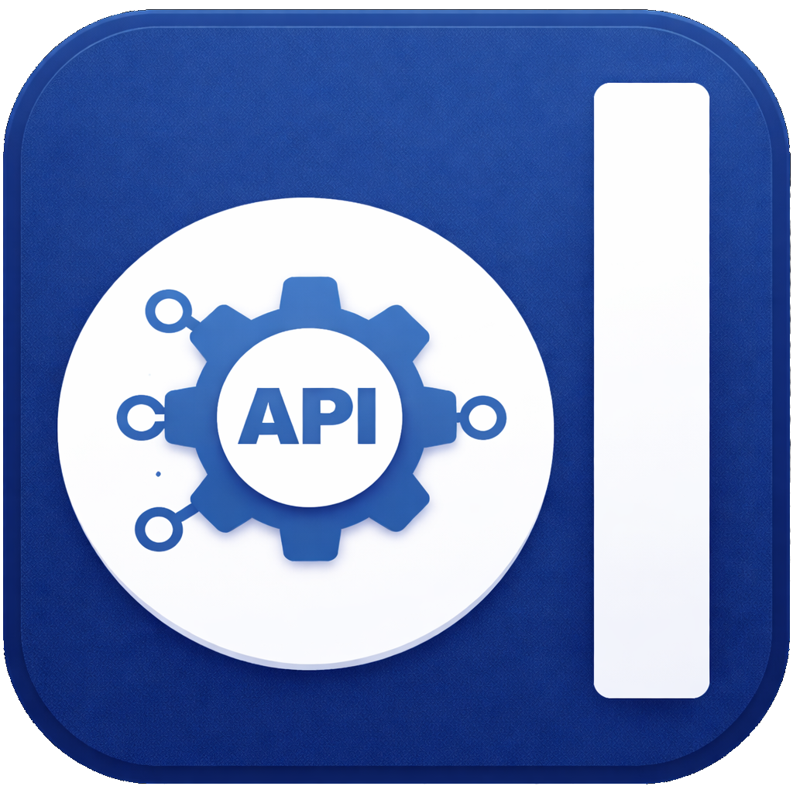
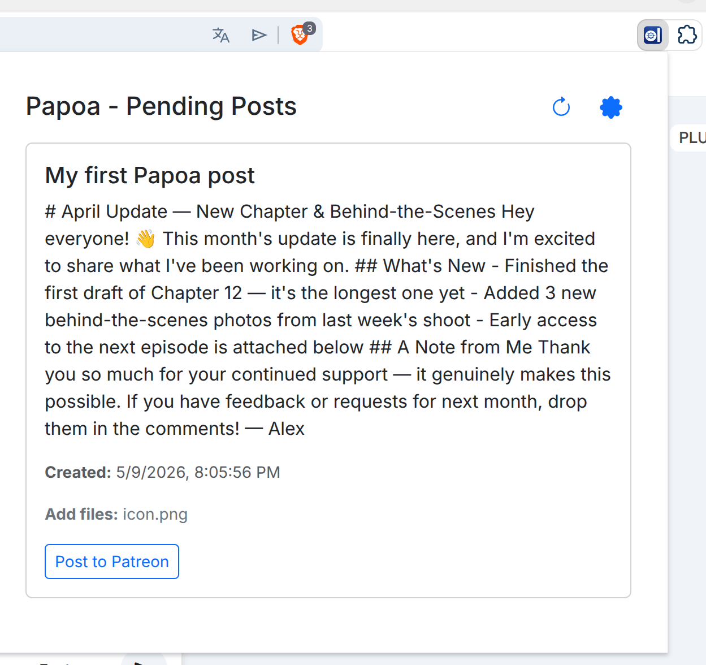
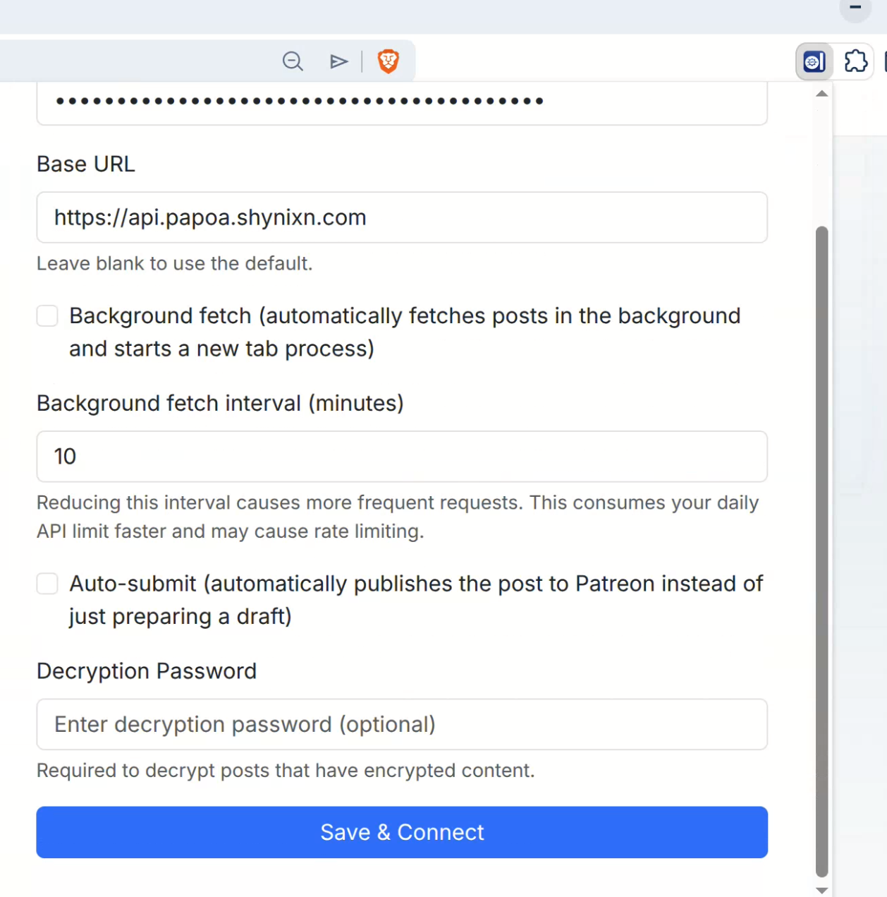

<div align="center">
  
  <h1>Papoa</h1>
  <p>
    
    
    
    
  </p>
  <p>Programmatically prepare, publish and update posts on patreon.com.<br/>
  <sub>This project is not affiliated with patreon.com</sub></p>
  <hr/>
</div>

## Background

I distribute several programs on [patreon.com/Shynixn](https://patreon.com/Shynixn) and use Patreon to post regular updates to my supporters. With multiple programs each needing their own updates every month, creating all those posts by hand is tedious and error-prone — copy-pasting content, attaching files, double-checking formatting, repeat.

So I built Papoa to automate it. What makes this particularly frustrating is that Patreon, a market leader in creator monetisation, still does not offer a public API for creating or publishing posts in 2026. For a platform of that size and maturity, that is honestly embarrassing. Papoa works around that gap.

## How It Works

The official Patreon API does **not provide POST actions** for creating or publishing posts. On top of that, browser automation approaches based on **Selenium**, **headless browsers**, or other **fake-browser techniques** are typically **blocked by Cloudflare**. In practice, that means the usual **server-side automation routes are not viable**.

The remaining workable approach is similar to how **AI agents** interact with websites: a **browser-resident extension** operating inside a **real user session**. Papoa follows that model.

This API works by accepting your **post metadata and files**, storing that data in a **repository**, and then letting a **Chrome extension** poll for pending work. When the extension detects a job, it opens Patreon in your browser session and executes the required steps on your behalf using the browser's normal **autofill** and page interaction mechanisms.

To use this API, you need two parts:

1. An **integration** that sends your **post metadata and files** to this API. You can use the provided CLI or build your own
2. A **web browser** where you are already **logged in to your Patreon account**, with the **Chrome extension installed** and allowed to control the browser when patreon.com is open.

The **Chrome extension is fully public** in this repository, so you can inspect and verify exactly what it does before using it.

You do **not send Patreon credentials** to this service. Authentication stays **inside your own browser session**, and the extension operates **locally** in that session. From Patreon's point of view, this behaves like a browser automation or text autofill helper acting inside a **real, logged-in browser**, rather than a third-party service impersonating your account.

## Install and Create Your First Post

### Step 1 — Get Your API Key

Visit [papoa.shynixn.com](https://papoa.shynixn.com/) and agree to the terms of service. Your free-tier API key will be shown after acceptance.

For higher limits, subscribe to a membership at [patreon.com/c/shynixn/membership](https://www.patreon.com/c/shynixn/membership) and your key will be upgraded on re-login on [papoa.shynixn.com](https://papoa.shynixn.com/).

| Tier      | API Requests / Day | Posts / Month | Upload Limit / Month |
| --------- | ------------------ | ------------- | -------------------- |
| Free      | 300                | 1             | 5 MB                 |
| Basic     | 300                | 100           | 500 MB               |
| Elite     | 500                | 200           | 2 GB                 |
| Legendary | 500                | 500           | 5 GB                 |

### Step 2 — Download the CLI

Download the latest release for your platform from [GitHub Releases](https://github.com/Shynixn/PatreonPostApi/releases/latest).

### Step 3 — Configure the CLI

Open the interactive version of the CLI by just starting the downloaded CLI without any arguments.

e.g. for windows, double click the `papoa-win-x64.exe` file

For the full CLI reference, non interactive, see the [CLI documentation](papoa.docs/CLI.md).

It should prompt you for your API key.

```bash
No API key found. Set the PAPOA_API_KEY environment variable, or enter one now.
API key:
```

```bash

  ____
 |  _ \    __ _   _ __     ___     __ _
 | |_) |  / _` | | '_ \   / _ \   / _` |
 |  __/  | (_| | | |_) | | (_) | | (_| |
 |_|      \__,_| | .__/   \___/   \__,_|
                 |_|

Main Menu

> Posts
  Exit
```

Try the "list" command to see if the connection works as expected.

```bash
  ____
 |  _ \    __ _   _ __     ___     __ _
 | |_) |  / _` | | '_ \   / _ \   / _` |
 |  __/  | (_| | | |_) | | (_) | | (_| |
 |_|      \__,_| | .__/   \___/   \__,_|
                 |_|


No posts found.

Press any key to continue...
```

### Step 4 — Install the Chrome Extension

The CLI queues posts for the Chrome extension to publish on your behalf. [Follow the Chrome Extension Installation Guide](papoa.docs/ChromeExtension.md) to download, load, and configure the extension.

### Step 5 — Create Your First Post

Download these two sample files to get started:

- [post.md](https://github.com/Shynixn/PatreonPostApi/raw/main/papoa.resources/post.md) — sample post body
- [icon.png](https://github.com/Shynixn/PatreonPostApi/raw/main/papoa.resources/icon.png) — sample attached image

Place both files in the same folder, then open the Papoa interactive GUI (double-click the executable or run it without arguments). Use **Posts → Create**.

1. Enter a title and select Text file

```bash
Create Post

Title: My first Papoa post
Post text:

  None
  Inline text
> Text file
```

2. Select the post.md (Markdown) file and do not add any other files

```bash
Selected: none
Added: post.md
Add another file? [y/n] (n): n
```

3. Select text format markdown

```bash
Text format:

  text/plain
> text/markdown
```

4. Add the icon.png and do not add any other files

```bash
Added: icon.png
Add another file? [y/n] (n): n
```

5. Encrypt with password and add a personal password. You should use the same password for all of your posts.

```bash
Add another file? [y/n] (n): n
Encrypt with password? [y/n] (n): y
Password: ****
```

6. Success

```
  Uploaded icon.png.
Post created!
  Id:    017ef6005bf8435b8f0f541a81e3cef3
  Title: "" -> "My first Papoa post"
```

7. Use Post List to see all of your already created posts

```bash
╭──────────────────────────────────┬─────────────────────────────┬─────────────────────────────────────────────────────┬──────────────────┬──────────────────────────┬──────────────────────╮
│ Id                               │ Title                       │ Text                                                │ Files            │ Created At               │ Patreon Updated At   │
├──────────────────────────────────┼─────────────────────────────┼─────────────────────────────────────────────────────┼──────────────────┼──────────────────────────┼──────────────────────┤
│ 017ef6005bf8435b8f0f541a81e3cef3 │ "" -> "My first Papoa post" │ "" -> "# April Update — New Chapter & Behind-the-S… │ [] -> [icon.png] │ 2026-05-09T18:05:56.977Z │ 0001-01-01T00:00:00Z │
╰──────────────────────────────────┴─────────────────────────────┴─────────────────────────────────────────────────────┴──────────────────┴──────────────────────────┴──────────────────────╯
```

- This post has not been posted to patreon.com yet. You can see that the `Patreon Updated At` timestamp is not a valid value yet.
- Posts automatically vanish after 30 days from Papoa. They stay available in patreon.com but are no longer managed by Papoa.

### Step 7 — Automated posting to patreon.com

1. Click on the refresh button on the top right in the Papoa ChromeExtension to load your posts.

<details>
<summary>Screenshot — load posts</summary>



</details>

2. Open the settings page and go through each of this points.

<details>
<summary>Screenshot — settings page</summary>



</details>

**Patreon checklist**

Before continuing, make sure:

- You are logged into patreon.com in this browser.
- Your Patreon language is set to `English (United States)` — you can check this at https://www.patreon.com/settings/account.
- You accept that the extension cannot be held responsible if a post is published with incorrect settings (e.g. wrong tier permissions).

**Settings explained**

| Setting                 | What it does                                                                                                                                                |
| ----------------------- | ----------------------------------------------------------------------------------------------------------------------------------------------------------- |
| **Decryption password** | If you encrypted your files with a password in the CLI, enter that same password here so the extension can decrypt them before attaching.                   |
| **Background fetch**    | The extension automatically opens a new Patreon tab, fills in the post, and waits. You still need to click **Post** yourself. Use this for semi-automation. |
| **Auto-submit**         | The extension fills in the post _and_ clicks **Post** automatically — no user input needed. Combine with **Background fetch** for fully autonomous posting. |

> **Note:** Patreon can change their website at any time, which may temporarily break auto-submit. Always check your posts after publishing.

For this first test post, **leave both Background fetch and Auto-submit disabled**. This lets you review the filled-in post before submitting it yourself.

3. Click **Post to patreon.com** to queue the post for publishing.

---

For the full CLI command reference, see the [CLI documentation](papoa.docs/CLI.md).
For the REST API reference used by the CLI (and for building your own integrations), see the [API documentation](papoa.docs/API.md).

## Limits

This service does not support all functionalities of patreon.com web editor. Please test your use case using the free tier and submit feature requests by Github Issues. You can update the 1 free post per month multiple times and test different automation use cases. If you delete your post, you are going to loose access to it.

## Final Notes

Thank you for using Papoa — I hope it saves you as much time as it saves me. If you run into issues or have ideas, feel free to open an issue on GitHub. You can also message me via private message on https://patreon.com/c/Shynixn
