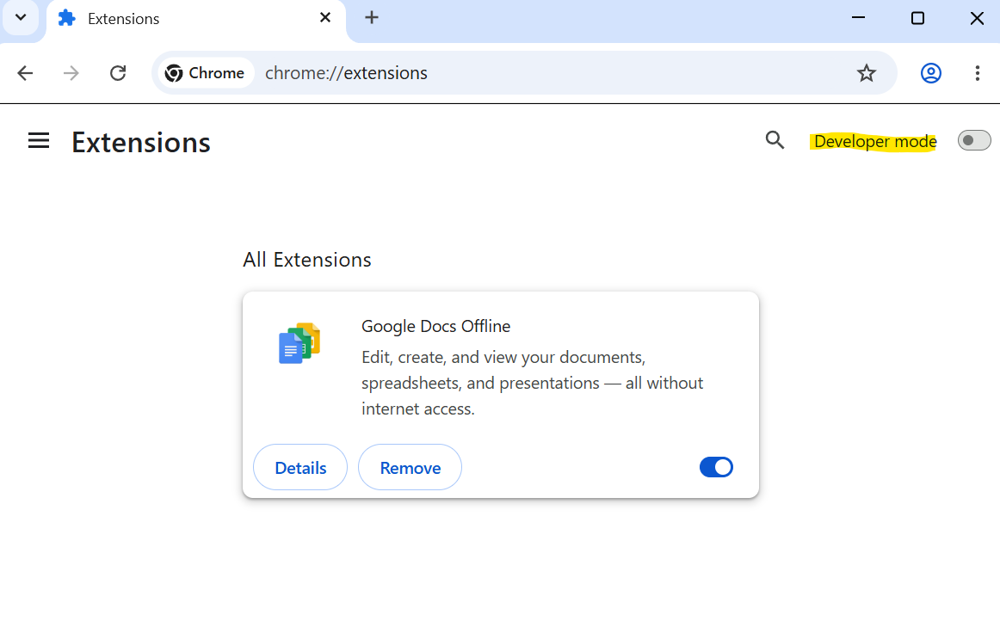
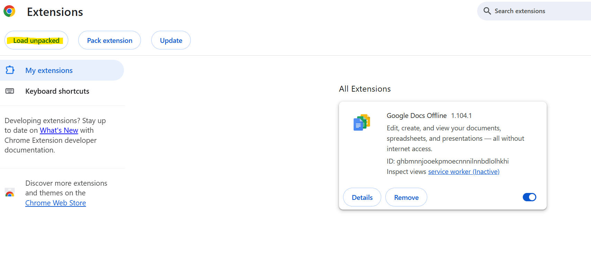
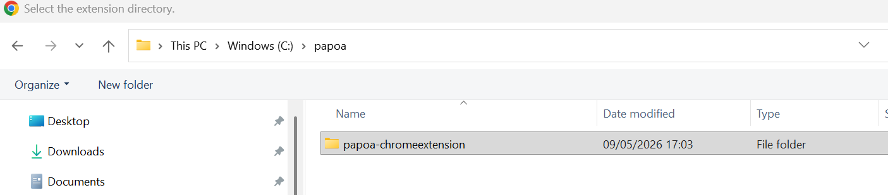
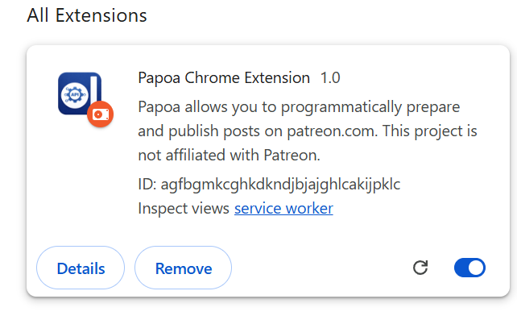
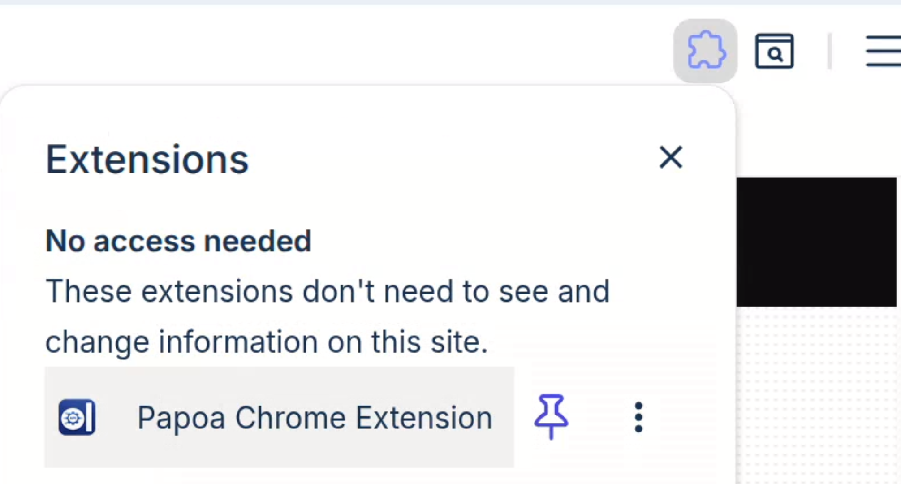
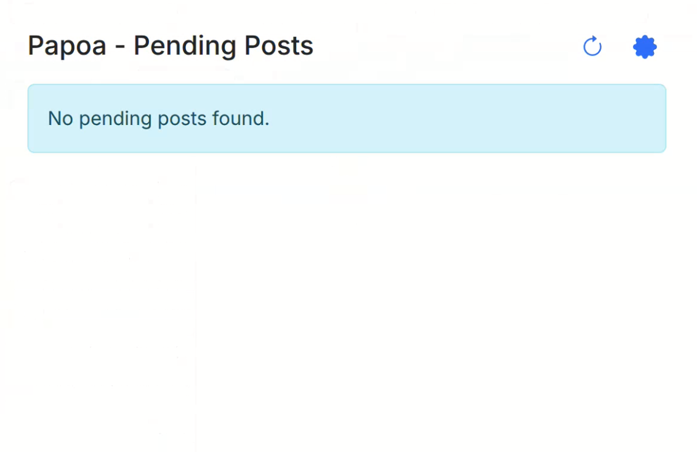

# Chrome Extension Installation

Download and install the Papoa Chrome extension to allow the CLI to publish your posts through your real browser session.

[**Download papoa-chromeextension.zip**](https://github.com/Shynixn/PatreonPostApi/releases/latest/download/papoa-chromeextension.zip)

---

## Installation Steps

### Step 1 — Extract the ZIP

Extract the downloaded `papoa-chromeextension.zip` to a permanent folder on your computer. Do not delete this folder — Chrome loads the extension directly from it.

### Step 2 — Open Chrome Extensions

Open Google Chrome and navigate to `chrome://extensions`. Enable **Developer mode** using the toggle in the top-right corner.

### Step 3 — Load the Extension

Click **Load unpacked** and select the folder where you extracted the extension.

### Step 4 — Configure the Extension

Click the Papoa icon in the Chrome toolbar and enter your API key. Make sure you are logged in to Patreon in the same browser.

Click on Save & Connect

